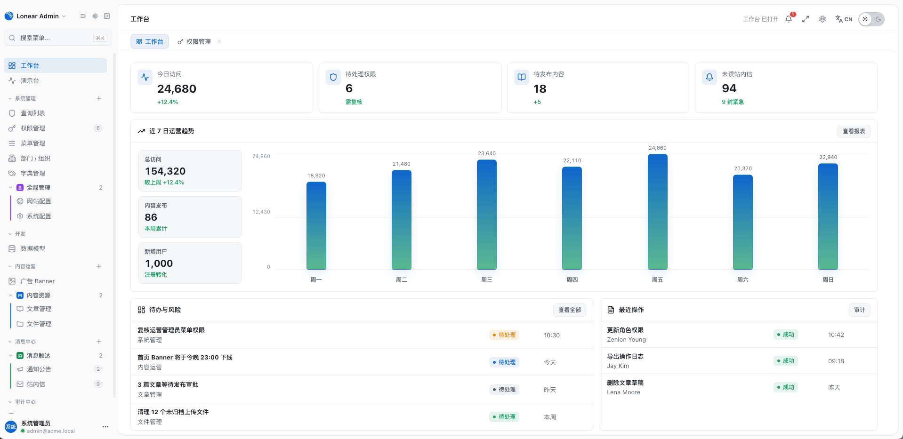
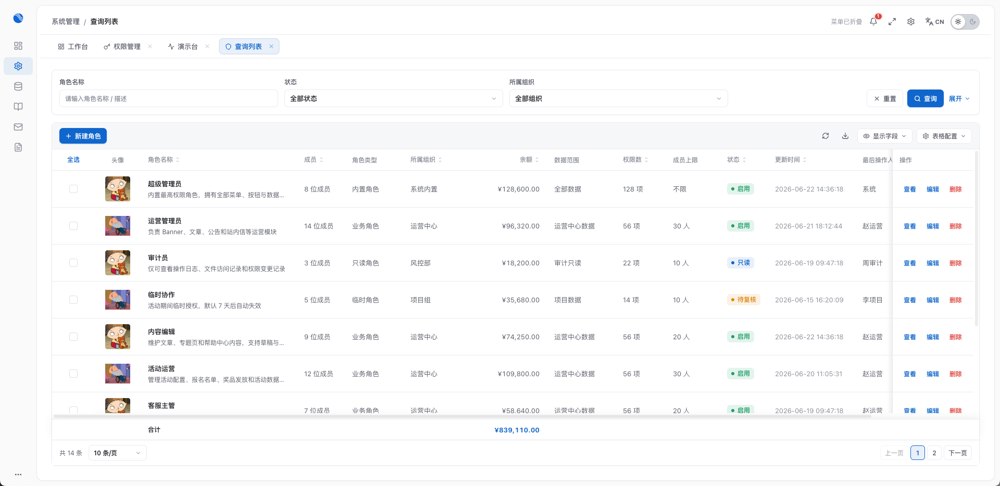
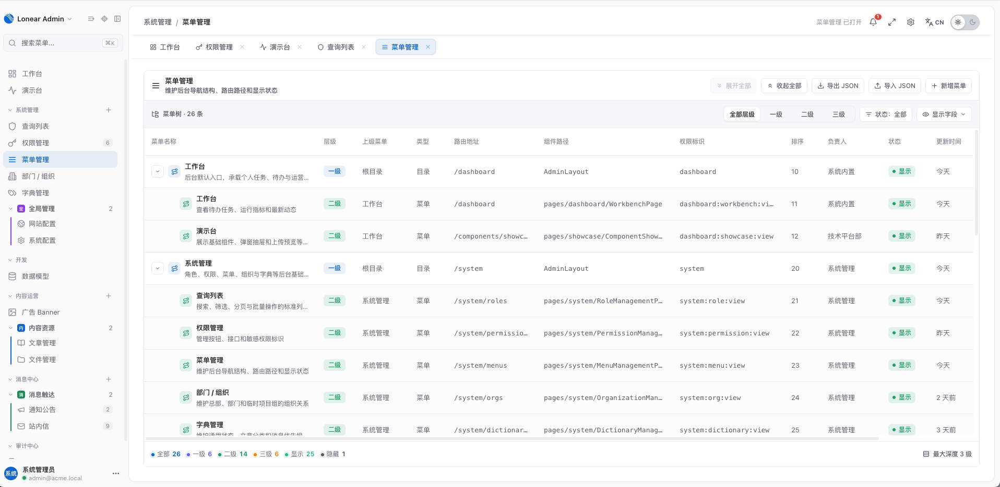
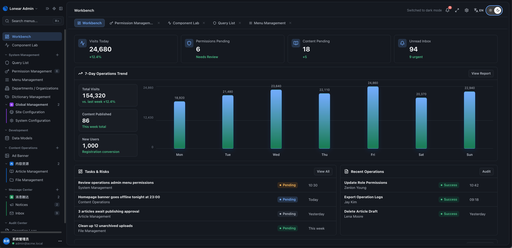

# Lonear Admin

中文 | [English](./README.en.md)

Lonear Admin 是一个基于 React、Vite 和 TypeScript 构建的开源后台管理界面模板。它不只是提供一套可复用的 Admin 页面，而是希望重新定义常见后台系统的视觉气质：更克制、更清爽、更有信息密度，也更接近真实工作台的效率感。

项目内置登录页、后台主布局、路由守卫、菜单导航、管理类页面、基础 UI 组件、本地 Mock API 和 PWA 基础能力，适合用作中后台系统、内容管理平台、运营后台或企业管理端的前端起点。

## 预览

### 工作台



### 查询列表



### 菜单管理



### 深色模式



## 项目定位

Lonear Admin 面向需要长期使用的后台系统，而不是一次性演示页面。它更关注信息组织、操作效率、视觉稳定性和真实业务页面的扩展能力。

- 面向开源：代码结构清晰，便于学习、改造和二次开发。
- 面向真实后台：内置查询列表、树形表格、配置页、审计日志、消息中心等常见场景。
- 面向设计探索：在常见 Admin Template 的基础上，探索更轻、更安静、更现代的后台界面语言。
- 面向快速预览：默认使用浏览器端 Mock API，无需后端即可体验完整交互。

## 在线演示

演示地址：[http://8.138.186.154](http://8.138.186.154)

默认演示账号：

```text
邮箱：admin@acme.local
密码：admin123
```

当前演示环境使用前端本地 Mock 数据，登录、菜单、角色、系统管理等请求会在浏览器端拦截并返回模拟数据，无需连接真实后端服务。

## 项目特性

- 基于 React 18、React Router、Vite 和 TypeScript。
- 界面风格参考 Linear，采用清晰层级、轻量边框、柔和阴影和工作台式信息组织。
- 内置管理员登录页、登录状态持久化和基础路由守卫。
- 提供工作台、系统管理、内容运营、消息中心、审计中心、开发辅助等常见后台模块。
- 内置查询列表、菜单管理、权限管理、组织管理、字典管理、文章管理、Banner 管理、文件管理、通知公告、站内信和操作日志等示例页面。
- 自研轻量 UI 组件，包含按钮、输入框、选择器、日期选择器、弹窗、抽屉、通知、标签、上传等。
- 支持浅色 / 深色主题、强调色切换、页签样式切换和主内容区布局配置。
- 使用本地 Mock API 演示完整交互流程，便于静态部署和快速预览。
- 包含 Web App Manifest 和 Service Worker，可作为 PWA 基础模板继续扩展。

## 页面范式

项目会持续沉淀后台系统中高频出现的页面模式：

- 工作台：用于概览指标、待办事项、快捷入口和近期动态。
- 查询列表：包含搜索表单、数据表格、分页、批量操作、列配置和导出等常见能力。
- 树形表格：适用于菜单、部门、分类、权限资源等层级数据。
- 配置页面：适用于网站配置、系统参数、账号策略等分组设置场景。
- 审计日志：适用于操作追踪、状态筛选、风险识别和记录详情查看。
- 组件演示：集中展示基础 UI 组件、交互状态和设计规范。

## 技术栈

- React 18
- TypeScript
- Vite
- React Router
- Lucide React
- 原生 CSS
- Local Mock API
- PWA Manifest + Service Worker

## 快速开始

安装依赖：

```bash
pnpm install
```

启动开发环境：

```bash
pnpm dev
```

生产构建：

```bash
pnpm build
```

本地预览生产构建：

```bash
pnpm preview
```

类型检查：

```bash
pnpm typecheck
```

## 目录结构

```text
src/
  api/            按业务域组织的接口模块
  components/
    ui/           基础 UI 组件，目录使用 lon-xxx，组件名使用 LonXxx
    shared/       多页面复用组件
  config/         模块注册、路由路径、导航和应用常量
  layouts/        后台主布局框架
  mocks/          本地 Mock 数据和请求拦截器
  pages/
    auth/         登录等认证页面
    dashboard/    工作台页面
    system/       系统管理页面
    content/      内容运营页面
    message/      消息中心页面
    audit/        审计页面
    development/  开发辅助页面
    showcase/     组件演示页面
  routes/         路由守卫、路由注册和页面映射
  services/       会话、请求、存储等应用服务
  styles/         全局样式与设计 tokens
  utils/          与框架无关的通用工具
```

新增业务页时，建议先在 `src/pages/<domain>` 添加独立页面组件，再到 `src/config/modules.ts` 注册模块信息、菜单和路由，最后在 `src/routes/adminPages.tsx` 建立 `ModuleId -> Page` 映射。

## Mock API

项目默认启用本地 Mock API。页面仍然通过 `src/api` 中的业务接口发起请求，匹配到的请求会由 `src/mocks` 返回本地数据。

如需关闭 Mock 并接入真实后端，可以在环境变量中设置：

```env
VITE_USE_MOCK=false
VITE_API_BASE_URL=https://your-api.example.com
```

## 部署说明

构建后将 `dist` 目录部署到静态 Web 服务即可：

```bash
pnpm build
```

如果使用 Nginx 并启用浏览器 history 路由，需要添加 SPA fallback：

```nginx
location / {
    try_files $uri $uri/ /index.html;
}
```

PWA 安装能力需要 HTTPS 环境；公网 IP 的 HTTP 访问通常不会触发浏览器的安装入口。部署到正式环境时建议绑定域名并配置 SSL 证书。

## License

MIT
